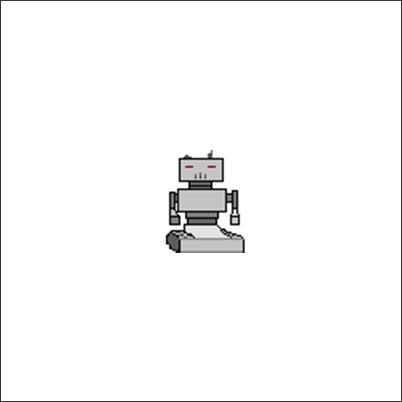

# Smallgame Lib.

### Base game circle



index.html
```html
<html>
  <body>
    <div id="container"></div>

    <script src="index.js"></script>
  </body>
</html>
```

index.ts
```ts
import { Game, Surface, Key } from 'smallgame'

const GAME_WIDTH       = 800
const GAME_HEIGHT      = 800
const HERO_WIDTH       = 100
const HERO_HEIGHT      = 100
const HERO_SPEED       = 5
const container        = document.getElementById('container')
const { game, screen } = Game.create(GAME_WIDTH, GAME_HEIGHT, container)
const hero             = new Surface(HERO_WIDTH, HERO_HEIGHT)
hero.fill('green')
hero.rect.moveSelf(screen.rect.center, 'center-center')

game.loop(() => {
  const keys = game.key.getPressed()
  
  if (keys[Key.K_A] || keys[Key.LEFT])  { hero.rect.x -= HERO_SPEED }
  if (keys[Key.K_D] || keys[Key.RIGHT]) { hero.rect.x += HERO_SPEED }
  if (keys[Key.K_W] || keys[Key.UP])    { hero.rect.y -= HERO_SPEED }
  if (keys[Key.K_S] || keys[Key.DOWN])  { hero.rect.y += HERO_SPEED }

  screen.clear()
  screen.blit(hero, hero.rect))
})
```

### Show an image

```ts
import { Game, loadImage } from 'smallgame'

const GAME_WIDTH  = 800
const GAME_HEIGHT = 800

async function main () {
  const container  = document.getElementById('container')
  const { screen } = Game.create(GAME_WIDTH, GAME_HEIGHT, container)
  const hero       = await loadImage('hero.png')

  screen.blit(hero, hero.rect)
}

main()
```

### Sketchs (Vector graphics)

```ts
import { Game, Sketch } from 'smallgame'

const GAME_WIDTH  = 400
const GAME_HEIGHT = 400
const container  = document.getElementById('container')
const { screen } = Game.create(GAME_WIDTH, GAME_HEIGHT, container)
const heroSketch = Sketch()
heroSketch.roundedrect({ fill: 'tomato' }, new Rect(10, 10, 200, 200), 16)
  
const hero = heroSketch.toSurface()
screen.blit(hero, hero.rect)
```


### Works with sprites

hero.ts
```ts
import { Sprite, Point, loadImage } from 'smallgame'

export class Hero extends Sprite {
  position = Point.zero

  async create () {
    this.image = await loadImage('hero.png')
    this.rect = this.image.rect
  }

  protected update(): void {
    this.rect.moveSelf(this.position, 'center-center')
  }

  moveUp()    { hero.position.y -= 5 }
  moveDown()  { hero.position.y += 5 }
  moveLeft()  { hero.position.x -= 5 }
  moveRight() { hero.position.x -= 5 }
}
```

index.ts
```ts
import { Game, Key } from 'smallgame'
import { Hero } from './hero'

const GAME_WIDTH  = 800
const GAME_HEIGHT = 800

async function main () {
  const container = document.getElementById('container')
  const { game, screen } = Game.create(GAME_WIDTH, GAME_HEIGHT, container)

  const hero = new Hero()
  await hero.create()
  hero.position = screen.rect.center

  game.loop(() => {
    const keys = game.key.getPressed()
    if (keys[Key.K_A] || keys[Key.LEFT])  { hero.moveLeft() }
    if (keys[Key.K_D] || keys[Key.RIGHT]) { hero.moveRight() }
    if (keys[Key.K_W] || keys[Key.UP])    { hero.moveUp() }
    if (keys[Key.K_S] || keys[Key.DOWN])  { hero.moveDown() }

    screen.fill('white')
    hero.draw(screen)
  })
}

main()
```

### Tile Maps

```ts
import { Game, loadTileMap } from 'smallgame'

const GAME_WIDTH  = 800
const GAME_HEIGHT = 800
const TILE_WIDTH  = 16
const TILE_HEIGHT = 16
const GAP         = 2

async function main() {
  const { screen } = Game.create(GAME_WIDTH, GAME_HEIGHT, container)
  const backgroud = createTileBackgroud()
  const map = await loadTileMap(TILE_WIDTH, TILE_HEIGHT, 'tileset.png')
  map.y = map.x = 0 | GAP / 2

  for (let i = 0; i < map.rows; i++) {
    for (let j = 0; j < map.cols; j++) {
      const image = map.cell(i, j)
      const x = j * (image.width + GAP)
      const y = i * (image.height + GAP)
      
      screen.blit(backgroud, { x, y })
      screen.blit(image, { x, y })
    }  
  }
}

function createTileBackgroud() {
  const rect = new Rect(0, 0, TILE_WIDTH + GAP, TILE_HEIGHT + GAP)
  const sketch = new Sketch()
  sketch.rect({ fill: 'gray' }, rect)
  return sketch.toSurface(rect.width, rect.height)  
}

main()
```
